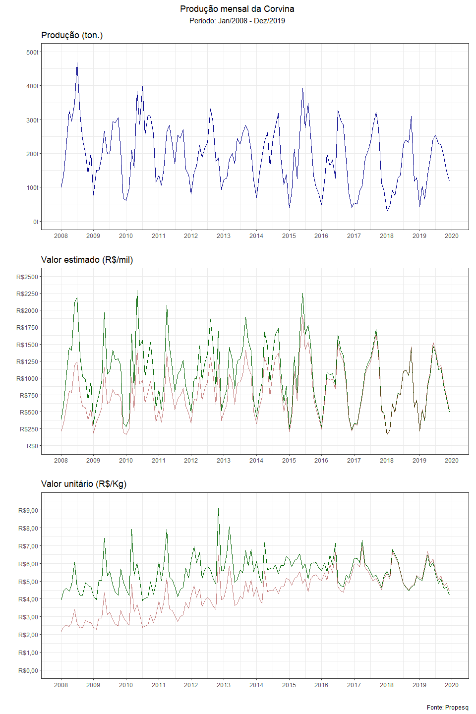
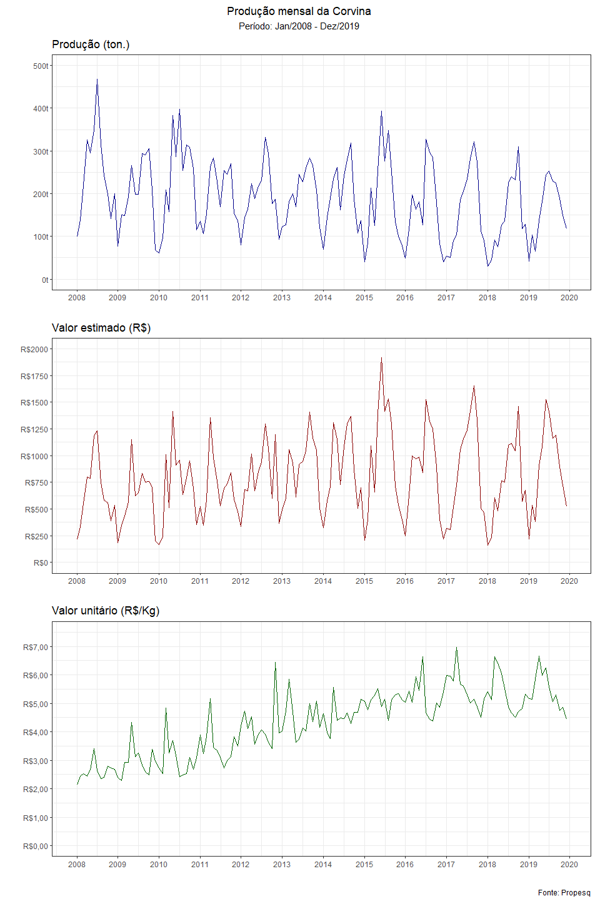
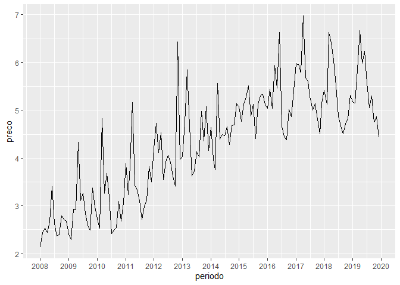

Modelo de oferta de pescado
================

## Objetivo

Analisar as características da oferta do pescado no litoral de São
Paulo, no período 2008-2019 propondo um modelo econométrico.

## Metodologia

  - Revisão bibliográfica sobre modelos econométricos de oferta de bens.
  - Regressão de quantidades e preços do pescado.

## Justificativa

Compreender a oferta do pescado no estado de São Paulo sob uma
perspectiva econométrica e quantitativa.

## Revisão bibliográfica

A oferta de um bem é resultado da tomada de decisão de seu produtor em
relação à quantidade produzida a um determinado nível de preço deste
bem. Essa decisão é feita com base nos custos e tecnologia usada para
produção.

Na oferta de mercado reflete a quantidade de bens que todos os
produtores de um mercado estão dispostos a produzir e vender ao preço de
mercado.

Em geral, a relação entre quantidade ofertada e preço de um bem é
positiva. Um produtor é incentivado a produzir mais de seu bem uma vez
que preços maiores proporcionam maiores rendimentos. Além dos custos e
técnologias já citados, outros fatores como tributação/subsídio e
sazonalidade também são importantes para determinação da quantidade
ofetada de um bem.

## Modelo teórico

A teoria da oferta expressa a quantidade de um bem ofertada em função de
seu preço.

\[Q_{pescado} = f(P_{pescado})\]

Em que \(Q\) é a quantidade e \(P\) é o preço do *quilo* do pescado em
um dado período de tempo.

## Modelo econométrico

A proposta de modelagem econométrica da oferta de pescado no período
2008-2019 é feita por meio do método de Mínimos Quadrados Ordinários
(MQO), onde através da minimização dos quadrados dos resíduos se obtém a
variância dos dados. O modelo é logaritmizado para obtenção do
coeficiente de elasticidade.

\[\ln{Q_{pescado}} = \beta_{1} + \beta_{2} * \ln{P_{pescado}} + u\]

Onde \(\ln{Q_{pescado}}\) é a variável dependente, \(\ln{P_{pescado}}\)
a explicativa. \(\beta\) são os parâmetros do modelo e \(u\) é o termo
de erro aleatório. Segundo Gujarati (2000) os termos de erro aleatório
\(u\) devem seguir o os pressupostos:

  - \(E(u \mid x) = 0\);
  - Homocedasticidade (\(Var(u \mid X) = \sigma^{2}\) constante);
  - Ausência de correlação
    (\(Cor(u_i, u_j) = 0 \;\;\;\; \forall \; i \ne j\)) e
  - \(Cov(u_i \mid X_i) = 0\).

O coeficiente de determinação \(R^2\) mede o ajustamento da equação de
regressão aos dados amostrais e varia entre \(0\) e \(1\). Com ele
busca-se compreender a proporção da variação da variável dependente
\(Y\) que é explocado pelos regressores \(X\). O coeficiente de
determinação \(R^2\) ajustado mede a aderencia do modelo em relação aos
dados considerando o número de variáveis e o tamanho da amostra.

A estatística \(F\) testa se as variáveis explicativas \(X\) do modelo
tem, de fato, efeito sobre a variável dependente \(Y\). Sob hipótese
nula (\(H_0\)) nenhum dos regressores \(X\) afeta a variável dependente
\(Y\). Na hipótese alternativa (\(H_1\)), pelo menos um dos regressores
são relevantes para explicar \(Y\) sob o grau de liberdade e nível de
significãncia adequado. Para cada variável, isoladamente, um teste \(t\)
de *student* é realizado com níveis de significância (\(p-value\)) de
1%, 5% e 10%.

### Elasticidade da oferta

A elasticidade-preço da oferta é um indicador de sensibilidade da
quantidade ofertada em relação às variações nos preços de um bem. Ela
mede a variação na quantidade da oferta que ocorre quando há uma
variação no preço de venda de um bem. Uma curva de oferta pode ser
considerada mais inelástica quanto menor for o impacto das variações de
preço sobre a quantidade ofertada deste bem.

### Dados

Os dados utilizados são do Propesq.

``` r
library(tidyverse)
library(kableExtra)

propesq <- "../data/propesq.rds" %>% read_rds()

corvina <- propesq %>%
  filter(valor_estimado > 0 & pescado == "Corvina") %>%
  mutate(preco = valor_estimado / qtd_descargas)

corvina
```

    ## # A tibble: 8,803 x 12
    ##      ano   mes municipio aparelho_de_pes~ nivel_taxonomico pescado    kg
    ##    <int> <int> <chr>     <chr>            <chr>            <chr>   <dbl>
    ##  1  1998     1 Cananéia  cerco-fixo       Peixe Ósseo      Corvina    18
    ##  2  1998     1 Cananéia  emalhe-de-fundo  Peixe Ósseo      Corvina  1339
    ##  3  1998     1 Cananéia  espinhéis-diver~ Peixe Ósseo      Corvina    13
    ##  4  1998     1 Cananéia  espinhel-de-fun~ Peixe Ósseo      Corvina    48
    ##  5  1998     1 Cananéia  multi-artes      Peixe Ósseo      Corvina     4
    ##  6  1998     1 Ilha Com~ emalhe-de-fundo  Peixe Ósseo      Corvina    83
    ##  7  1998     1 Ilha Com~ emalhe-de-super~ Peixe Ósseo      Corvina    35
    ##  8  1998     2 Cananéia  arrasto-duplo    Peixe Ósseo      Corvina     8
    ##  9  1998     2 Cananéia  cerco-fixo       Peixe Ósseo      Corvina    12
    ## 10  1998     2 Cananéia  emalhe-de-fundo  Peixe Ósseo      Corvina  1257
    ## # ... with 8,793 more rows, and 5 more variables: qtd_descargas <int>,
    ## #   qtd_unidades_produtivas <int>, valor_estimado <dbl>, periodo <date>,
    ## #   preco <dbl>

``` r
corvina %>%
  filter(ano > 2007) %>%
  ggplot() +
  geom_boxplot(aes(x = factor(ano), y = preco/10, color = factor(ano)), show.legend = F) +
  scale_y_log10() +
  theme(axis.text.x = element_text(angle = 90, vjust = .5, hjust = .5))
```

<!-- -->

``` r
corvina %>%
  filter(ano > 2007) %>%
  ggplot() +
  geom_jitter(aes(x = factor(mes), y = preco/10), show.legend = F, alpha=.1) +
  geom_point(data = corvina %>% filter(ano > 2007) %>% group_by(mes) %>% summarise(preco_medio = mean(preco/10)),
             aes(x = factor(mes), y = preco_medio),
             color = "red", size = 3) +
  scale_y_log10() +
  theme(axis.text.x = element_text(angle = 90, vjust = .5, hjust = .5))
```

<!-- -->

``` r
corvina %>%
  ggplot() +
  geom_smooth(aes(x = preco/10, y = kg/100), method = 'lm') +
  geom_point(aes(x = preco/10, y = kg/100), alpha = .3, show.legend = F) +
  scale_x_log10() +
  scale_y_log10()
```

<!-- -->

``` r
corvina %>% mutate(preco2 = valor_estimado / kg) %>%
    ggplot() +
  geom_smooth(aes(x = preco2/10, y = kg/100), method = 'lm') +
  geom_point(aes(x = preco2/10, y = kg/100), alpha = .3, show.legend = F) +
  scale_x_log10() +
  scale_y_log10()
```

<!-- -->

``` r
glimpse(corvina)
```

    ## Observations: 8,803
    ## Variables: 12
    ## $ ano                     <int> 1998, 1998, 1998, 1998, 1998, 1998, 19...
    ## $ mes                     <int> 1, 1, 1, 1, 1, 1, 1, 2, 2, 2, 2, 2, 2,...
    ## $ municipio               <chr> "Cananéia", "Cananéia", "Cananéia", "C...
    ## $ aparelho_de_pesca       <chr> "cerco-fixo", "emalhe-de-fundo", "espi...
    ## $ nivel_taxonomico        <chr> "Peixe Ósseo", "Peixe Ósseo", "Peixe Ó...
    ## $ pescado                 <chr> "Corvina", "Corvina", "Corvina", "Corv...
    ## $ kg                      <dbl> 18, 1339, 13, 48, 4, 83, 35, 8, 12, 12...
    ## $ qtd_descargas           <int> 3, 36, 2, 5, 1, 4, 1, 1, 5, 36, 3, 8, ...
    ## $ qtd_unidades_produtivas <int> 1, 23, 1, 1, 1, 2, 1, 1, 5, 23, 3, 1, ...
    ## $ valor_estimado          <dbl> 13.30, 1432.59, 9.10, 51.80, 2.80, 83....
    ## $ periodo                 <date> 1998-01-01, 1998-01-01, 1998-01-01, 1...
    ## $ preco                   <dbl> 4.433333, 39.794167, 4.550000, 10.3600...
